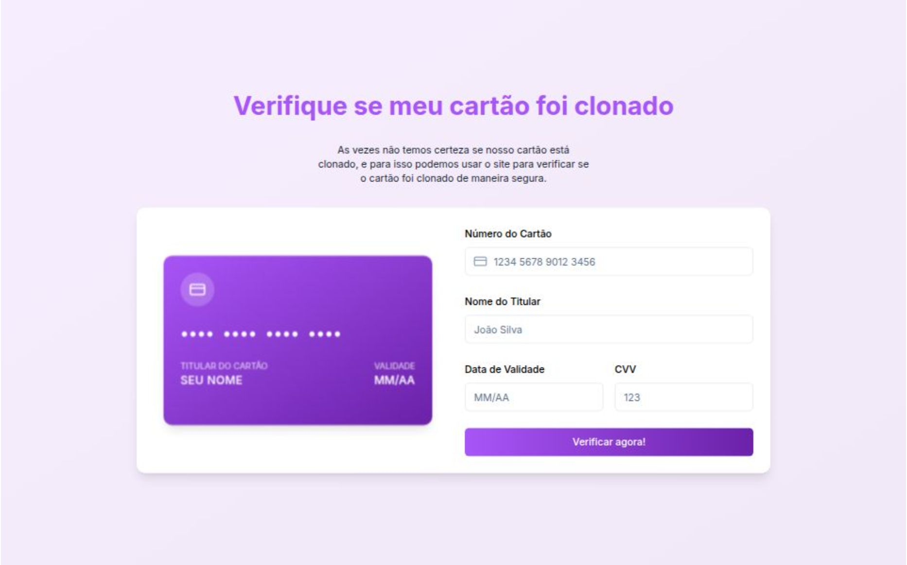

# Verifique Meu Cartão Clonado

Uma aplicação inovadora que valida se seu cartão de crédito foi clonado, integrando de forma segura bases de dados atualizadas dos maiores vazamentos.

## Descrição

Este projeto foi desenvolvido para demonstrar, de maneira prática, os riscos do ambiente digital, mostrando se o seu cartão de crédito foi clonado. Inspirado por uma "brincadeira" observada em um grupo, decidi ir além e criar minha própria versão, aproveitando a oportunidade para testar a plataforma V0 — que utiliza IA para construir interfaces rapidamente.

## Tecnologias Utilizadas

- **Next JS 15**
- **Shad cn ui**
- **Tailwindcss**
- **Framer Motion**
- Resolução de desafios relacionados ao SVG dos cartões para uma interface ainda mais realista

## Funcionalidades

- **Validação de clonagem de cartão:** Integração com bases de dados seguras e atualizadas dos maiores vazamentos para verificar se o cartão foi clonado.
- **Interface interativa e realista:** Animações e desafios gráficos resolvidos para proporcionar uma experiência única ao usuário.
- **Desenvolvimento ágil:** Projeto criado em cerca de 20 minutos, com ajustes finos realizados em mais 10 minutos (sem auxílio de IA nesse refinamento).

## Como Executar o Projeto

1. **Clone o repositório:**

   ```bash
   git clone https://github.com/filipeleonelbatista/verifique-meu-cartao-clonado.git
   ```

2. **Instale as dependências:**

   ```bash
   cd verifique-meu-cartao-clonado
   npm install
   ```

3. **Inicie o projeto:**

   ```bash
   npm run dev
   ```

## Acesso à Aplicação

Experimente a aplicação diretamente através deste link:  
[Aplicação Verifique Meu Cartão Clonado](https://lnkd.in/dusNPyGn)

## Contribuições

Contribuições são bem-vindas!  
Sinta-se à vontade para abrir _issues_ e enviar _pull requests_ para melhorias e novas funcionalidades.

## Licença

Este projeto está sob a licença MIT. Consulte o arquivo [LICENSE](LICENSE) para mais detalhes.

## Hashtags

#SegurançaDigital #Cibersegurança #NextJS #TailwindCSS #FramerMotion #DataBreach #Inovação #DesenvolvimentoWeb #PrivacidadeDigital #AI #V0 #Vercel
```